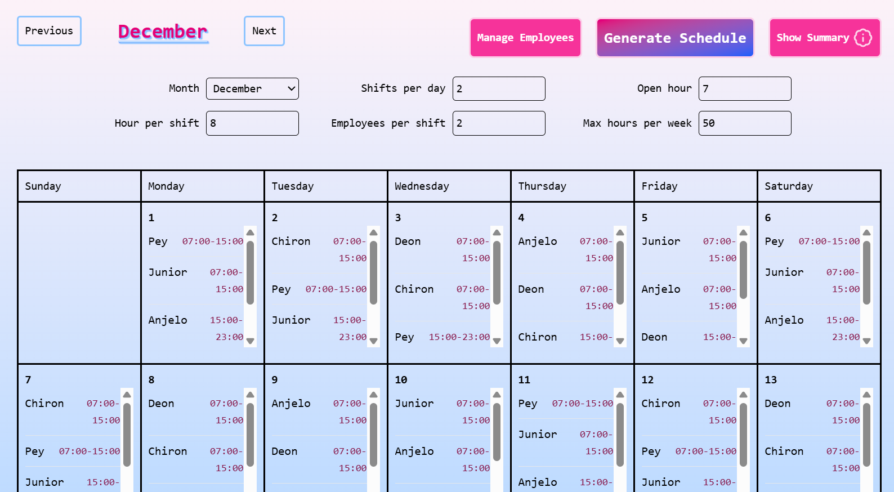

<h1 align="center">Automatic Scheduling App</h1>

<p align="center">
  <strong>Automatic Employee Scheduling App</strong> – A simple full-stack web application for automatic employee scheduling and employee management, including CRUD operations, shift planning, weekly summaries, and overwork detection.
</p>

---

<!-- Badges -->
<p align="center">
  
  
  
  
  
  
  <a href="https://github.com/Mas-Pey/automatic-scheduling-app/actions/workflows/node.js.yml" target="_blank">
    
  </a>
</p>

---

## Project Description

**Scheduler App** is a **full-stack web application** for automatically generating employee schedules based on shifts, available hours, and maximum weekly hours.

Features:

- Automatic shift scheduling per month
- Employee management (CRUD)
- Weekly/Monthly summary & overworked employee detection

It includes:

- **Backend**: Fastify + TypeScript + Better SQLite + Automated tests with `node:test`
- **Frontend**: React + TypeScript + TailwindCSS + Vite

---

## 🚀 Demo

Try the live app here:  
- **Frontend:** [https://automatic-scheduling.netlify.app/](https://automatic-scheduling.netlify.app/)  
- **Backend (API):** [https://automatic-scheduling-api.fly.dev/](https://automatic-scheduling-api.fly.dev/)

<p align="center">
  
</p>

---

## Flow Diagram

### Scheduling Logic

<p align="center">
  
</p>

The diagram above shows the automatic scheduling logic:

1. Receive POST `/create-schedule` request
2. Validate input & fetch employees from DB
3. Loop through days, shifts, and assign employees
4. Calculate weekly hours, median, and overworked employees
5. Return full schedule & summary

---

## Get Started

> **Prerequisite:** Make sure you have **Node.js (v18+)** and **npm** installed.  
> You can download Node.js from [https://nodejs.org](https://nodejs.org).

### Backend

```bash
cd backend
npm install
npm run dev
```

### Frontend

```bash
cd frontend
npm install
npm run dev
```

---

## 🙏 Acknowledgements

Special thanks to the following projects that made this app possible:

- [react-calendar](https://github.com/zackify/react-calendar) – For the calendar UI component used in the frontend.
- [better-sqlite3](https://github.com/WiseLibs/better-sqlite3) – For providing a fast and simple SQLite interface in the backend.